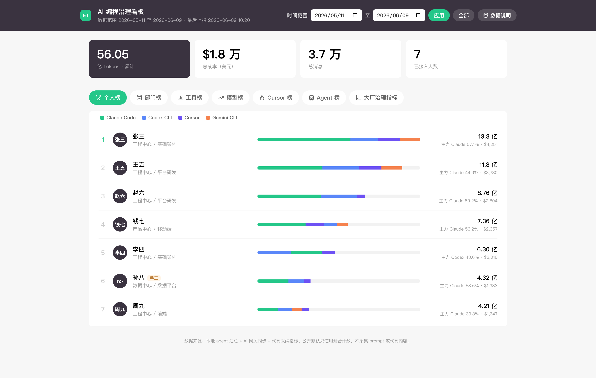
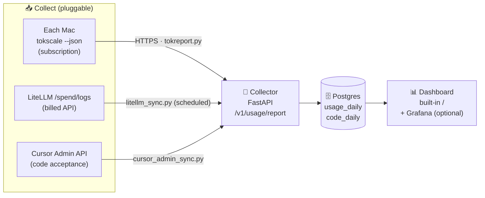
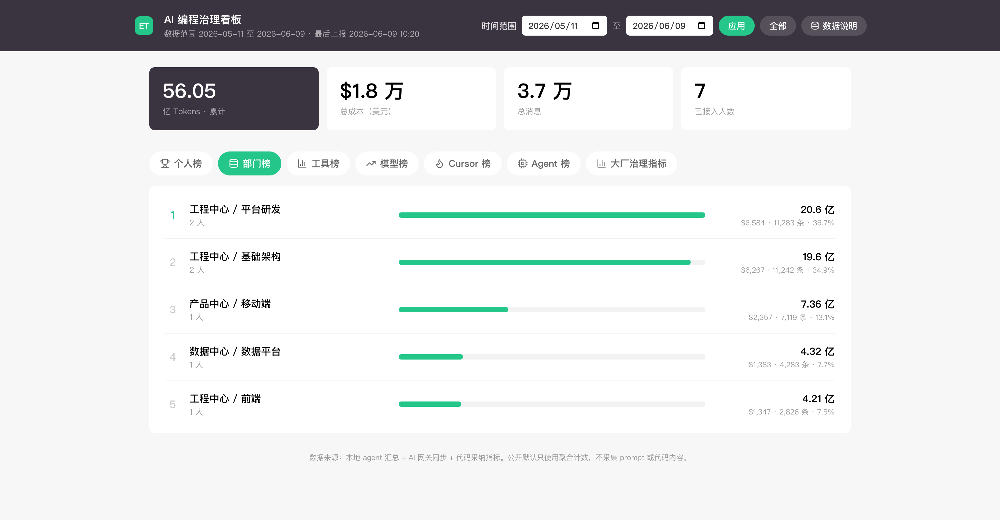
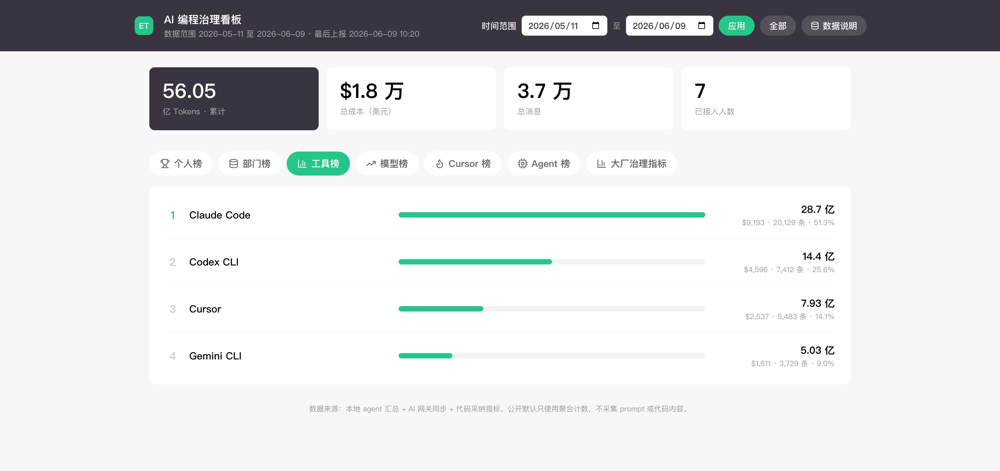
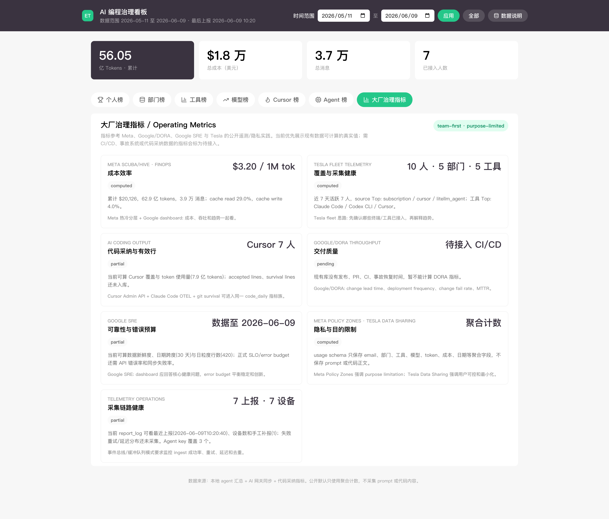

<div align="center">

# 🏆 Enterprise Token Leaderboard

**A token-consumption leaderboard & governance dashboard for enterprise AI coding**

Roll up token usage from every AI coding tool your team runs — Claude Code, Codex,
Cursor, Gemini CLI and more — into one board: who uses it, how much, how much it costs,
and how much of the AI-written code actually gets accepted. One screen, one answer.

[](LICENSE)
[](https://www.python.org/)
[](https://fastapi.tiangolo.com/)
[](https://www.postgresql.org/)
[](https://docs.docker.com/compose/)
[](#-contributing)

[简体中文](README.md) · **English**

</div>

<div align="center">

</div>

---

## What is this

Teams are adopting AI coding tools at scale, but the **usage is scattered**: some lives in
the LiteLLM gateway, some in each developer's local Claude Code / Codex logs, some in the
Cursor admin console. Nobody can answer the one-line question —

> *"How many tokens did we burn this month, what did it cost, who's actually using it, and
> how much of the AI-generated code got accepted?"*

**Enterprise Token Leaderboard** collects those sources, **attributes them to people, and
ranks them** — giving the org a neutral, governable AI-usage dashboard that is *not*
individual surveillance.

- 📊 **Both paths covered** — gateway API traffic (real \$) **and** subscription-based local
  usage (Claude Pro/Max, Codex subscriptions — which **never hit the gateway**), merged into one board.
- 🧩 **Zero lock-in, fully pluggable** — not tied to any MDM. Collectors, identity resolution,
  storage and dashboard are each a replaceable "seam."
- 🤫 **Low / zero employee friction** — identity auto-resolves (zero input), reports run
  silently in the background, no pop-ups.
- 🔐 **Privacy first** — only token counts / cost / model / timestamp are collected. The schema
  **structurally has no field for prompts or code.**
- 🏢 **Big-tech governance patterns** — Meta (Scribe / Scuba / purpose-limited PAI), Google/DORA,
  Google SRE, Tesla telemetry; and deliberately **not a per-person performance ranking** (team-first by default).

> [!NOTE]
> All screenshots use **synthetic mock data** generated by `seed_demo.py` (`zhangsan@example.com`,
> etc.). No real names, avatars, logos, or company information. The open-source repo ships neutral and runnable by default.

---

## ✨ Features

| | Feature | Notes |
|---|---|---|
| 📈 | **Multi-dimension boards** | Person / Team / Tool / Model / Cursor / Agent, switch window with `?days=7\|30\|90` |
| 🔀 | **Two data sources** | LiteLLM `/spend/logs` (billed API) + [tokscale](https://github.com/junhoyeo/tokscale) reading local logs (subscription), unified into `usage_daily` |
| 🧮 | **Second metric family** | Code **acceptance rate / effective lines** (Cursor Admin API + Claude Code OTEL + git survival) → `code_daily`, side by side with the token board |
| 🛡️ | **Big-tech governance metrics** | Cost efficiency / coverage health / privacy purpose-limitation / delivery quality / error budget — seven governance slots |
| 🪪 | **Zero-input identity** | `EMPLOYEE_EMAIL` (MDM) → `git config user.email` → login\@domain, falling back level by level |
| ♻️ | **Idempotent reporting** | Upsert keyed on `(email, date, source, tool, model)` — backfills / reruns / offline catch-up never double-count |
| 🚀 | **5-minute start** | `docker compose up` + one seed command — see something before you roll out |

---

## ⚡ Quick start (flagship dashboard in 1 minute, zero deps)

The **governance dashboard** in the screenshots is served by a zero-dependency
SQLite dev server (standard library only) — no Docker required:

```bash
git clone https://github.com/eggyrooch-blip/enterprise-token-leaderboard.git
cd enterprise-token-leaderboard/collector

# 1) Load synthetic demo data (zhangsan/lisi..., demo only)
DEV_DB=/tmp/tok-demo.db python3 seed_dev_demo.py
# 2) Start the dashboard (stdlib only, Python 3.6+)
DEV_DB=/tmp/tok-demo.db COLLECTOR_API_TOKENS=devtoken PORT=8090 python3 dev_collector.py &

open http://localhost:8090/           # ← person/team/tool/model/Cursor/Agent boards + governance metrics
```

### Production deployment (Postgres + Docker)

For production, use the FastAPI + Postgres collector (LiteLLM/Cursor sync, optional Grafana):

```bash
cd collector
cp .env.example .env                  # at minimum set COLLECTOR_API_TOKENS=devtoken
docker compose up -d                  # starts postgres + collector(:8088) + grafana(:3000)
COLLECTOR_URL=http://localhost:8088 COLLECTOR_TOKEN=devtoken python seed_demo.py
open http://localhost:8088/
```

---

## 🏗️ Architecture



The whole system revolves around **one stable contract** — the normalized record
(`usage_date, source, tool, model, *_tokens, cost_usd`). **As long as a new source can
produce that shape, it plugs in and nothing downstream changes.** Five seams:

| Seam | Change one place | Purpose |
|---|---|---|
| Collectors | add a class in `agent/collectors/` | onboard a new tool (codex/gemini/in-house) |
| Identity | `agent/identity.py` | swap to SSO / OIDC / device_id |
| `source` dimension | set a new `source` label on upsert | add a server-side collection path |
| sink | `tokreport.py: post()` | HTTP → Kafka / direct DB / S3 |
| storage / dashboard | same wide table | Postgres→ClickHouse, Grafana→Metabase |

See [`ARCHITECTURE.md`](ARCHITECTURE.md) · big-tech trade-offs in [`BIG-TECH-PATTERNS.md`](BIG-TECH-PATTERNS.md) · code metrics in [`CODE-METRICS.md`](CODE-METRICS.md).

---

## 🔄 How data syncs

| Source | `source` | Collected by | Frequency | What it captures |
|---|---|---|---|---|
| Subscription local usage | `subscription` | per-machine `agent/tokreport.py` (reads tokscale `--json`) | daily, silent | tokens from local tools on Claude Pro/Max, Codex subscriptions, etc. |
| Gateway traffic | `api` | `collector/litellm_sync.py` (pulls LiteLLM `/spend/logs`) | cron / CronJob | real billed usage going through API keys |
| Code acceptance | `cursor`, etc. | `collector/cursor_admin_sync.py` | daily | acceptance rate, effective lines, suggestion accept rate |

All three **look back a few days idempotently**; the collector upserts by primary key, so
offline catch-up and reruns never double-count.

---

## 📦 Rolling out the client (pick one — no MDM required)

**A. With MDM** (root, device-pushed identity, most robust)

```bash
agent/package_mdm.sh ./tokscale https://<collector> <token> ./dist
# hand dist/tokreport-mdm.tar.gz to your MDM; on the target: sudo ./install.sh .
```

**B. No MDM** (rootless, employee runs once, then silent background)

```bash
curl -fsSL https://intranet/tok/bootstrap.sh | \
  COLLECTOR_URL=https://<collector> COLLECTOR_TOKEN=xxx bash
```

**C. Bundle into provisioning / dotfiles** — fold step B into your existing dev-env setup script.

Leave identity blank and it auto-uses `git config user.email` — zero employee input.
Collectors are controlled by `COLLECTORS=` (`tokscale` covers 25+ tools but needs a binary;
`claude_code` is a zero-dependency reference collector).

---

## 📸 More views

| Team board | Tool / Model board | Big-tech governance metrics |
|---|---|---|
|  |  |  |

---

## 🔐 Privacy & compliance

- **Aggregates only**: token counts / cost / model / time. The single entry point
  `/v1/usage/report` validates strictly and **has no prompt/code field by construction** — over-collection is impossible at the source.
- **Purpose limitation + retention**: tag data with a `purpose` (e.g. `cost_allocation`) and
  auto-purge on expiry (`collector/retention.sql`).
- **Team first**: the default dashboard is team/department level; per-person views are
  access-controlled and audited, avoiding Goodhart-style metric gaming.
- ⚠️ **Before going live**, align with Security / Legal / HR and notify employees per local
  law. Low-friction collection involves employee data — compliance is a prerequisite.

---

## 🗺️ Roadmap

- [ ] Swap sink to Kafka/Redpanda (event-bus ingest)
- [ ] Raw-event cold table / Parquet on S3 (hot/cold tiering)
- [ ] Direct Claude Code OTEL acceptance collection
- [ ] Wire governance metrics to real CI/CD & incident-system data
- [ ] More collectors: Gemini CLI / Kimi CLI / OpenCode direct read

---

## 🤝 Contributing

PRs welcome! Adding a new tool collector is three steps: write a class implementing
`UsageCollector` in `agent/collectors/` → register a line in `collectors/__init__.py: REGISTRY`
→ set `COLLECTORS=...,yoursource`. Nothing downstream changes.

```bash
pip install -r collector/requirements.txt
pytest                                  # run tests
python scripts/open_source_guard.py     # desensitization self-check (run before committing)
```

---

## 📄 License

[MIT](LICENSE) © Enterprise Token Leaderboard contributors

<div align="center">

If this project is useful to you, a ⭐ **Star** is the best encouragement.

</div>
