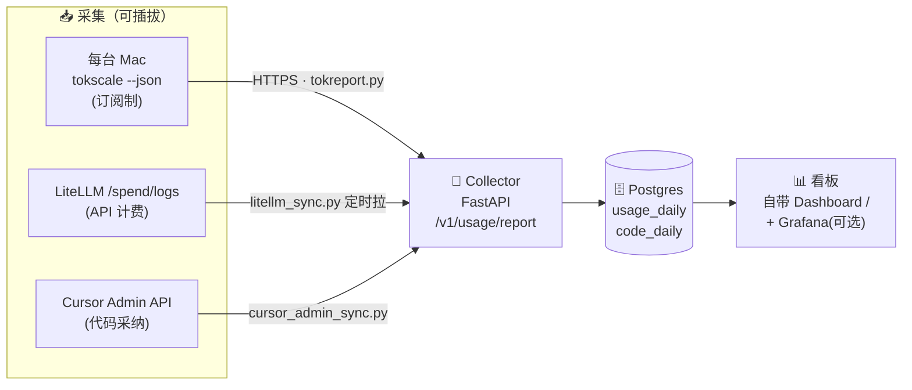
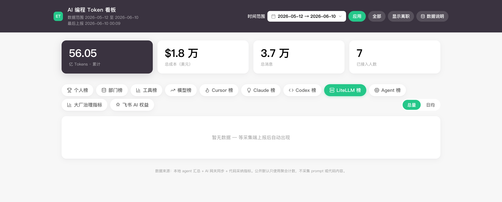
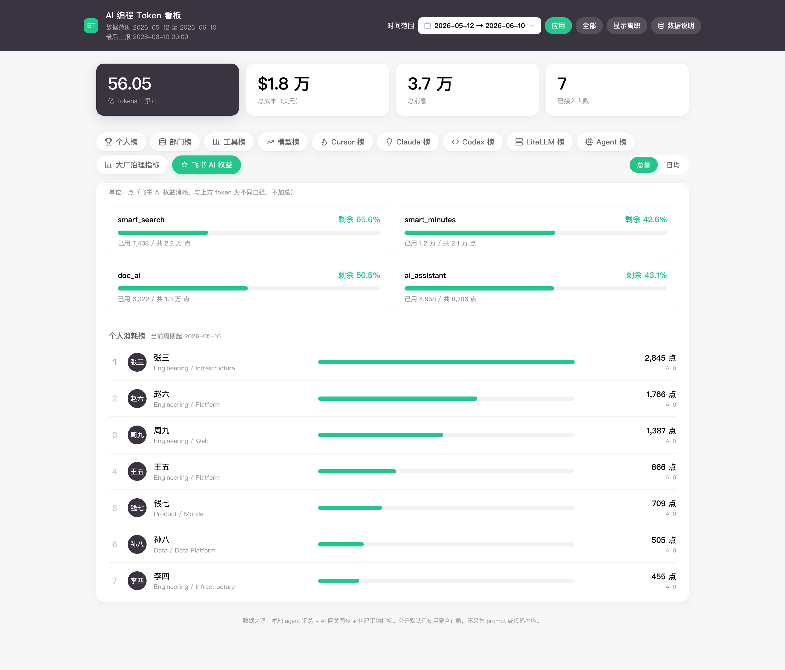

<div align="center">

# 🏆 Enterprise Token Leaderboard

**企业 AI 编程 Token 消耗排行榜 & 治理看板**

把团队里 Claude Code / Codex / Cursor / Gemini CLI 等所有 AI 编程工具的 token 消耗
汇成一张榜 —— 谁在用、用了多少、花了多少、代码采纳率多高，一屏看清。

[](LICENSE)
[](https://www.python.org/)
[](https://fastapi.tiangolo.com/)
[](https://www.postgresql.org/)
[](https://docs.docker.com/compose/)
[](#-参与贡献)

**简体中文** · [English](README.en.md)

</div>

<div align="center">

</div>

---

## 这是什么

各团队都在大规模用 AI 编程工具，但**用量散落在各处**：LiteLLM 网关里有一份、每个人本地的 Claude Code / Codex 日志里有一份、Cursor 后台又一份。没人能回答一句话的问题——

> 「这个月我们到底烧了多少 token、花了多少钱、谁在认真用、AI 写的代码到底被采纳了多少？」

**Enterprise Token Leaderboard** 把这些来源**统一采集、统一归属到人、统一出榜**，给企业一个
中性、可治理、不做个人监控的 AI 编程用量看板。

- 📊 **两路全采** —— API 网关流量（有真实 \$）+ 订阅制本地用量（Claude Pro/Max、Codex 订阅，**不经过网关**），两路合并出榜。
- 🧩 **零绑定、可插拔** —— 不绑定任何 MDM，采集源、身份解析、存储、看板每一处都是可替换的「扩展缝」。
- 🤫 **员工弱感知 / 无感知** —— 身份自动解析（零录入），后台静默上报，无弹窗无打扰。
- 🔐 **隐私优先** —— 只采 token 计数 / 成本 / 模型 / 时间，**结构上根本没有 prompt 或代码字段**。
- 🏢 **借鉴大厂治理** —— Meta（Scribe / Scuba / PAI 按目的限制）、Google/DORA、Google SRE、Tesla 遥测；并刻意**不做个人绩效式排行榜**（默认团队维度）。

> [!NOTE]
> 截图均为合成 mock 数据（`zhangsan@example.com` 等），不含任何真实姓名、头像、Logo 或公司信息。开源仓库默认中性可运行。

---

## ✨ 核心特性

| | 特性 | 说明 |
|---|---|---|
| 📈 | **多维度榜单** | 个人 / 部门 / 工具 / 模型 / Cursor / Claude / Codex / LiteLLM / Agent 榜，`?days=7\|30\|90` 任意切窗 |
| 🔀 | **两路数据源** | LiteLLM `/spend/logs`（API 计费）+ [tokscale](https://github.com/junhoyeo/tokscale) 读本地日志（订阅制），统一落 `usage_daily` |
| 🟦 | **SaaS AI 权益板块** | 把没有官方 API 的 SaaS 后台 AI 用量（如飞书 AI 权益）也拉进同一看板，作为**独立板块**（单位「点」，不与编程 token 加总）—— 见「飞书采集器」 |
| 🧮 | **第二指标族** | 代码**采纳率 / 有效代码行**（Cursor Admin API + Claude Code OTEL + git 存活分析）→ `code_daily`，与 token 榜并排 |
| 🛡️ | **大厂治理指标** | 成本效率 / 覆盖健康 / 隐私目的限制 / 交付质量 / 错误预算 …… 七个治理槽位 |
| 🪪 | **可插拔身份归属** | `EMPLOYEE_EMAIL`（MDM/SSO 下发）→ 设备序列号（收集端反解目录）→ 登录名@域名，逐级兜底；另含可选 git-email 解析器（默认关闭） |
| ♻️ | **幂等上报** | 按 `(email, date, source, tool, model)` upsert，补传 / 重跑 / 离线追报都不会重复计数 |
| 🚀 | **1 分钟起步** | 零依赖 SQLite demo，一条 seed + 一条启动命令 |

---

## ⚡ 快速开始（1 分钟看到旗舰看板，零依赖）

截图里这个**治理看板**由零依赖的 SQLite 开发服务（仅标准库）伺服，无需 Docker：

```bash
git clone https://github.com/eggyrooch-blip/enterprise-token-leaderboard.git
cd enterprise-token-leaderboard/collector

# 1) 灌入合成演示数据（张三/李四…，仅用于演示）
DEV_DB=/tmp/tok-demo.db python3 seed_dev_demo.py
# 2) 起看板（标准库，Python 3.6+ 即可）
DEV_DB=/tmp/tok-demo.db COLLECTOR_API_TOKENS=devtoken PORT=8090 python3 dev_collector.py &

open http://localhost:8090/           # ← 个人/部门/工具/模型/Cursor/Claude/Codex/LiteLLM/Agent 榜 + 大厂治理指标 + 飞书 AI 权益
```

### 生产部署（Postgres + Docker）

正式环境用 FastAPI + Postgres 收集端（带 LiteLLM/Cursor 同步、可选 Grafana）：

```bash
cd collector
cp .env.example .env                  # 至少设 COLLECTOR_API_TOKENS=devtoken
docker compose up -d                  # 起 postgres + collector(:8088) + grafana(:3000)
COLLECTOR_URL=http://localhost:8088 COLLECTOR_TOKEN=devtoken python seed_demo.py
open http://localhost:8088/
```

---

## 🏗️ 架构



整个系统围绕**一条稳定契约** —— 归一化 record（`usage_date, source, tool, model, *_tokens, cost_usd`）。
**只要新来源能产出这个形状，就能接入，下游一律不动。** 五个扩展缝：

| 扩展缝 | 改一处 | 用途 |
|---|---|---|
| 采集源 collectors | `agent/collectors/` 加一个类 | 接入新工具（codex/gemini/公司自研） |
| 身份 identity | `agent/identity.py` | 换 SSO / OIDC / device_id |
| source 维度 | upsert 时填新 `source` 标签 | 新增一路服务端采集 |
| sink | `tokreport.py: post()` | HTTP → Kafka / 直写 DB / S3 |
| 存储 / 看板 | 同一张宽表 | Postgres→ClickHouse、Grafana→Metabase |

详见 [`ARCHITECTURE.md`](ARCHITECTURE.md) · 大厂取舍见 [`BIG-TECH-PATTERNS.md`](BIG-TECH-PATTERNS.md) · 代码指标见 [`CODE-METRICS.md`](CODE-METRICS.md)。

---

## 🔄 数据同步方式

| 来源 | `source` | 采集方 | 频率 | 拿到什么 |
|---|---|---|---|---|
| 订阅制本地用量 | `subscription` | 每台机器 `agent/tokreport.py`（读 tokscale `--json`） | 每日静默上报 | Claude Pro/Max、Codex 订阅等本地工具的 token |
| AI 网关流量 | `api` | `collector/litellm_sync.py`（拉 LiteLLM `/spend/logs`） | cron / CronJob | 走 API key 的真实计费用量 |
| 代码采纳 | `cursor` 等 | `collector/cursor_admin_sync.py` | 每日 | 采纳率、有效行、suggestion 接受率 |
| SaaS AI 权益 | `feishu` 板块 | `collector/feishu/`（无官方 API → 拷 Chrome profile + CDP 旁路抓后台） | 每日 | 飞书 AI 权益额度 / 趋势 / 全员逐人用量（单位「点」，独立板块） |

各路都**幂等回看几天**，收集端按主键 upsert，离线补传 / 重复跑都不会翻倍。

> **飞书 AI 权益采集器**（`collector/feishu/`）：飞书没有官方 AI 权益用量 API，方案是拷一份已登录的
> Chrome profile → headless 起调试端口 → Playwright 经 CDP 连上去，让页面用自己的鉴权在**网络层旁路抓响应**
> （对防篡改不可见），归一化后 HTTPS 上报，**绝不直连 DB / 不存 cookie 到库**。详见 `collector/feishu/README.md`。

---

## 📦 下发客户端（三选一，不绑定 MDM）

**A. 有 MDM**（按系统分开推送脚本，最稳）

macOS 独立入口（LaunchAgent，下载 `/tokreport.sh`）：

```bash
COLLECTOR=https://<collector> bash agent/mdm_bootstrap.sh
```

Windows 独立入口（Task Scheduler / Scheduled Task，下载 `/tokreport.ps1`）：

```powershell
powershell -NoProfile -ExecutionPolicy Bypass -File agent/mdm_bootstrap_windows.ps1 -Collector https://<collector> -Token <token>
```

如需离线包，macOS 仍可使用：

```bash
agent/package_mdm.sh ./tokscale https://<collector> <token> ./dist
# 把 dist/tokreport-mdm.tar.gz 交给 MDM 下发，目标机：sudo ./install.sh .
```

**B. 没有 MDM**（免 root，员工执行一次，之后静默后台跑）

```bash
curl -fsSL https://intranet/tok/bootstrap.sh | \
  COLLECTOR_URL=https://<collector> COLLECTOR_TOKEN=xxx bash
```

**C. 随装机 / dotfiles 捆绑** —— 把 B 的步骤并进你现有的开发环境初始化脚本即可。

身份默认走 MDM 下发的 `EMPLOYEE_EMAIL` 或设备序列号（收集端反解目录），员工零操作；无 MDM 的团队可启用内置 git-email 解析器（`agent/identity.py`，默认关闭）。采集源由 `COLLECTORS=` 控制
（`tokscale` 一把覆盖 25+ 工具，需二进制；`claude_code` 零依赖参考实现）。

---

## 📸 更多看板

| 部门榜 | 工具 / 模型榜 | LiteLLM 榜 |
|---|---|---|
|  |  |  |

| 大厂治理指标 | 飞书 AI 权益（独立板块，单位「点」） |
|---|---|
|  |  |

---

## 🔐 隐私与合规

- **只采聚合计数**：token 数 / 成本 / 模型 / 时间。唯一入口 `/v1/usage/report` 强校验，**结构上没有 prompt / 代码字段**，从源头杜绝越采。
- **目的限制 + 保留期**：给数据打 `purpose`（如 `cost_allocation`），到期自动清理（`collector/retention.sql`）。
- **团队优先**：默认看板用部门 / 团队维度，个人级视图受限访问 + 留痕，避免 Goodhart 式刷指标。
- ⚠️ **上线前必须**与安全 / 法务 / HR 对齐，并按当地法规对员工告知。无感知采集涉及员工数据，合规是前提。

---

## 🗺️ Roadmap

- [ ] sink 换 Kafka/Redpanda（事件总线 ingest）
- [ ] 原始事件冷表 / Parquet 落 S3（热冷分层）
- [ ] Claude Code OTEL 直采采纳率
- [ ] 治理指标接入 CI/CD、事故系统真实数据
- [ ] 更多 collectors：Gemini CLI / Kimi CLI / OpenCode 直读

---

## 🤝 参与贡献

欢迎 PR！加一个新工具采集源只需：在 `agent/collectors/` 写一个实现 `UsageCollector` 的类 →
在 `collectors/__init__.py: REGISTRY` 登记一行 → 配置 `COLLECTORS=...,你的源`。下游零改动。

```bash
pip install -r collector/requirements.txt
pytest                                  # 跑测试
python scripts/open_source_guard.py     # 脱敏自检（提交前必跑）
```

---

## 📄 License

[MIT](LICENSE) © Enterprise Token Leaderboard contributors

<div align="center">

如果这个项目对你有用，**点个 ⭐ Star** 是最大的鼓励。

</div>
